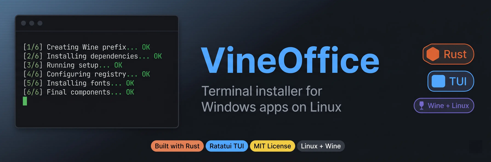
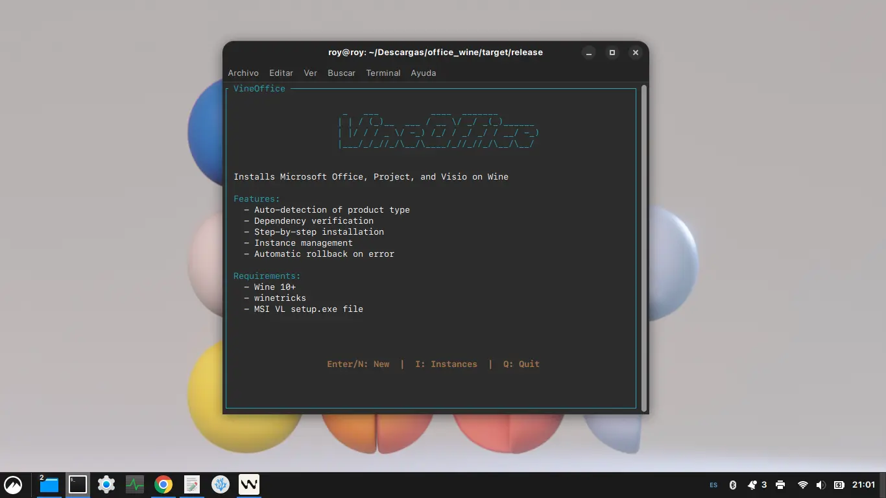
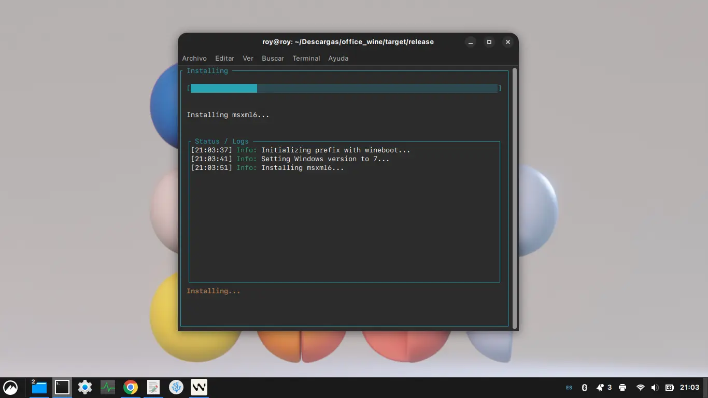
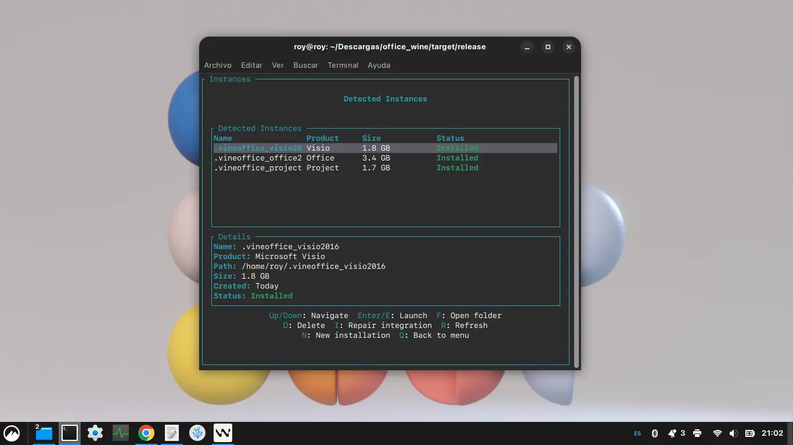
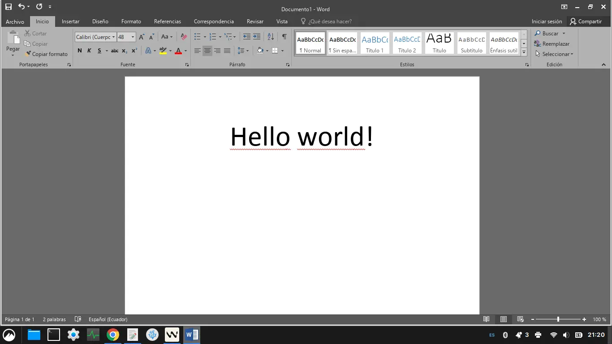

<p align="center">
  
</p>

<h1 align="center">VineOffice</h1>

<p align="center">
  <a href="https://www.rust-lang.org/">
    
  </a>
  <a href="https://ratatui.rs/">
    
  </a>
  <a href="https://tokio.rs/">
    
  </a>
  <a href="LICENSE">
    
  </a>
</p>

<p align="center">
  Terminal-based installer for Microsoft Office 2016, Project 2016, and Visio 2016 on Linux via Wine
</p>

---

## Quick Start

```bash
git clone https://github.com/roy-mejia/vineoffice.git
cd vineoffice
cargo build --release
./target/release/vineoffice
```

---

## Features

| Feature | Description |
|---------|-------------|
| **Product Auto-Detection** | Automatically identifies Office, Project, or Visio from setup files |
| **6-Step Installation Pipeline** | Automated prefix creation, dependency installation, Office setup, registry configuration, font installation, and final components |
| **Resumable Installations** | JSON state persistence allows resuming interrupted installations |
| **Automatic Rollback** | Removes prefix on critical step failure to prevent broken states |
| **Font Management** | Downloads and installs Segoe UI fonts from GitHub with local caching |
| **Desktop Integration** | Creates .desktop entries, MIME associations, and launcher scripts |
| **Instance Management** | List, launch, delete, and repair existing Wine prefixes |
| **Progress Tracking** | Real-time progress bars with detailed step information |
| **Generic Prefix Support** | While targeting Office/Project/Visio 2016, the prepared Wine prefix supports running other Windows applications for testing |

---

## Prerequisites

| Dependency | Purpose | Installation |
|------------|---------|--------------|
| **Wine** 10+ | Windows compatibility layer | `sudo apt install wine64 wine32` |
| **winetricks** | Wine configuration utility | `sudo apt install winetricks` |
| **Microsoft Office 2016 Setup** | Installation media | User-provided (ISO or extracted) |

**Note:** 32-bit Wine support is required for Office 2016. The application verifies this during dependency checks.

---

## Installation

```bash
# Clone repository
git clone https://github.com/roy-mejia/vineoffice.git
cd vineoffice

# Build release binary
cargo build --release

# Binary location
target/release/vineoffice
```

---

## Usage

```bash
# Run the installer
./target/release/vineoffice
```

1. **Welcome Screen**: Start new installation or resume existing
2. **Dependency Check**: Verify Wine, winetricks, and system dependencies
3. **File Selection**: Browse and select Office setup.exe
4. **Installation**: 6-step automated installation with progress tracking
5. **Completion**: Launch Office or exit to desktop integration

**Managed Prefixes:**
- Prefixes are created in `~/.wine/` with `.vineoffice_<product>_<version>` naming
- Access Instance Manager from welcome screen to list, launch, or delete prefixes

---

## Project Structure

```
src/
├── main.rs              # Application entry point
├── app.rs               # State machine and screen navigation
├── core/                # Business logic
│   ├── installation.rs  # 6-step installation pipeline
│   ├── wine_prefix.rs   # WINEPREFIX management
│   ├── product.rs       # Product type detection
│   ├── state.rs         # Installation state persistence
│   ├── instance_manager.rs  # Prefix CRUD operations
│   ├── desktop_integration.rs # .desktop entry creation
│   ├── registry.rs      # Wine registry modifications
│   ├── rollback.rs      # Automatic rollback on failure
│   ├── font_manager.rs  # Segoe UI font download/install
│   ├── dependencies.rs  # System dependency verification
│   └── prefix_naming.rs # Prefix naming conventions
├── ui/                  # Terminal interface
│   ├── screens/         # 6 installation screens
│   ├── components/      # Reusable UI components
│   └── theme.rs         # ratatui styling
└── utils/               # Utilities
    ├── command.rs       # Async command execution
    ├── logging.rs       # tracing_appender setup
    ├── format.rs        # Human-readable formatting
    ├── fs.rs            # Filesystem helpers
    └── validators.rs    # Dependency validation
```

---

## Credits

| Project | Description | License |
|---------|-------------|---------|
| [Segoe UI Linux](https://github.com/mrbvrz/segoe-ui-linux) | Segoe UI font family including emoji, with Wine prefix support | MIT |
| [Wine](https://www.winehq.org/) | Compatibility layer for Windows applications on POSIX systems | LGPL-2.1+ |
| [Winetricks](https://github.com/Winetricks/winetricks) | Workaround utility for Wine installation and configuration issues | LGPL-2.1+ |

---

## Screenshots

<p align="center">
  <b>Welcome Screen</b><br>
  
</p>

<p align="center">
  <b>Installation Progress</b><br>
  
</p>

<p align="center">
  <b>Instance Manager</b><br>
  

<p align="center">
  <b>MS Word 2016</b><br>
  
</p>

---

## License

MIT License. See [LICENSE](LICENSE) for details.
